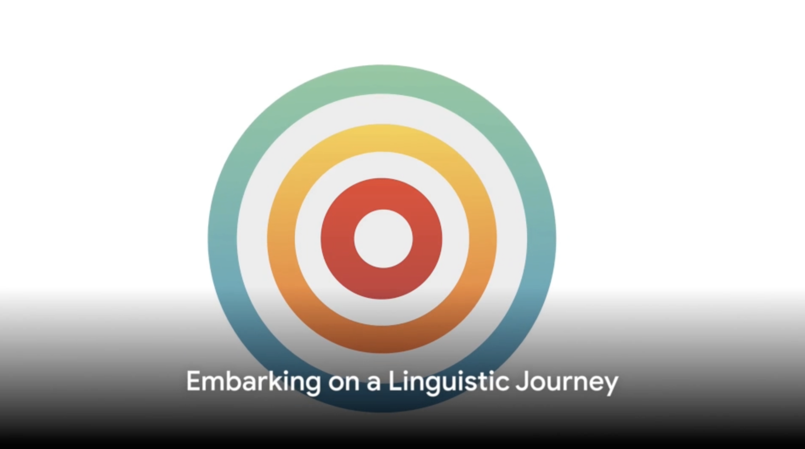

# Conversationally
Conversationally is a AI based conversational tutor created by a team of five students of Masters in Data Science course at UC Berkeley as part of the final Capstone project. It leverages multiple NLP techniques to create a conversation centric approach to second language learning. The final presentation deck
## Promo Video

## Demo Video

# Team
# Approach
# Models
## Model 1:
## Model 2:
## Model 3:
## References
## Acknowledgments
# Conclusion
