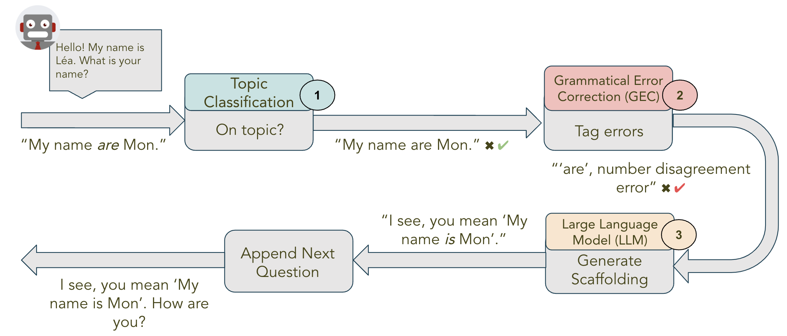

# Conversationally
Conversationally is a AI based conversational tutor created by a team of five students of Masters in Data Science course at UC Berkeley as part of the final Capstone project. It leverages multiple NLP techniques to create a conversation centric approach to second language learning.
## Materials
 Name|Type|Link
-|-|-
Deck|pdf| [capstone_presentation.pdf](media/capstone_presentation.pdf)
Promo Video|mp4| [conversationally_promo_small.mp4](media/conversationally_promo_small.mp4)
Demo Video|mov| [conversationally_demo.mov](media/conversationally_demo.mov)
Architecture Definition|pdf| [project_langbot_architecture.pdf](media/project_langbot_architecture.pdf)
Backend APIs|Code Repo|[project-langbot-webapp](https://github.com/team-langbot/project-langbot-webapp)
Web Application|Code Repo|[langbot-ui](https://github.com/team-langbot/langbot-ui)
Content Classification Model|Code Repo|[content-classification](https://github.com/team-langbot/content-classification)
Grammatical Error Correction Model|Code Repo|[model-gec](https://github.com/team-langbot/model_gec)
Response Generation|Code Repo|[GPT](https://github.com/team-langbot/GPT)

# Team

  

    
    
Aastha Khanna
    
    

    
Aastha Khanna is a software development engineer at Amazon, currently working on Ring Virtual Security Guard security system.

  

  

  

  
Isabel Chan
  
  

  
Isabel is a Data Engineer at , where she is involved in the ad measurement and support of various advertising products.

  

  

Jess Matthews

Jess Matthews is VP of Global Product Management at Gartner where she oversees a portfolio of data-driven products supporting HR executives.

  

  

Mon Young

Mon Young founded ABiCO Capital Management, America branch. He presently directing the IT DevOps and Data Science divisions at Panasonic R&D Company of America.

  

  

Ram Senthamarai

Ram is an experienced software engineer. He worked in the visual search domain in his last role at Amazon.
  

# Approach
As part of this project, we implemented a chatbot for language learners to hold a scenario based conversation with. The chatbot is a web based application, built and hosted using AWS Amplify. It is powered by three models based on Natural Language Processing techniques. All our models are hosted on Amazon SageMaker and accessed through backend APIs.

## Model 1:
The first model is focussed on keeping the conversation on topic, helping learner stay focussed on learning objective. We use a [Sentence Transformer](https://huggingface.co/sentence-transformers/multi-qa-MiniLM-L6-cos-v1) to generate the semantic embeddings for both Bot's output and user's response to it. A cosine similarity measure helps identify if user's response is on topic or not.

There are two key notebooks that have all the code related this model.

Notebook|Description
-|-
[content_classification.ipynb](https://github.com/team-langbot/content-classification/blob/main/content_classification.ipynb) | Experimentation with the Sentence Transformer model as well as the evaluation on test dataset.
[create-endpoint-01-sbert-Copy1.ipynb](https://github.com/team-langbot/content-classification/blob/main/create-endpoint-01-sbert-Copy1.ipynb) | Code for creating an Amazon SageMaker endpoint to serve inference calls.

## Model 2:
The second model is a token classification model that classifies each word in an input sentence as one of three classes - no error, gender mismatch error or number mismatch error. We have a separate model as explicit error identification keeps LLM based responses predictable and on-topic. It also makes language learning easier. We fine tuned [Beto](https://huggingface.co/dccuchile/bert-base-spanish-wwm-cased) which is Spanish BERT model on the [COWS-L2H](https://github.com/ucdaviscl/cowsl2h) dataset.

There are four key notebooks for GEC model:

Notebook|Description
-|-
[EDA.ipynb](https://github.com/team-langbot/model_gec/blob/main/EDA.ipynb)|Basic EDA on COWS-L2H dataset.
[gec_bert_data_prep.ipynb](https://github.com/team-langbot/model_gec/blob/main/gec_bert_data_prep.ipynb)|More GEC model specific EDA and Feature Engineering
[pytorch_gec_bert_plain.ipynb](https://github.com/team-langbot/model_gec/blob/main/pytorch_gec_bert_plain.ipynb)| Model training and evaluation
[gec_inference_setup.ipynb](https://github.com/team-langbot/model_gec/blob/main/deployment/gec_inference_setup.ipynb)| Creating SageMaker endpoint.

Finally, artifacts from each model training run are on [WandB](https://wandb.ai/langbot/projects) with project [langbot_gec_plain_top_performers](https://wandb.ai/langbot/langbot_gec_plain_top_performers) having the model that was finally deployed.

## Model 3:
The third model in our sequence is a generative model that handles generating hints about any error in user input. These hints are also called scaffolding. We experimented with multiple LLMs for this and finally selected [Mistral 7b](https://huggingface.co/docs/transformers/main/model_doc/mistral) model for generating scaffolding.

Key notebooks for this model:

Notebook|Description
-|-
[create-ep03-mistral2.ipynb](https://github.com/team-langbot/GPT/blob/main/create-ep03-mistral2.ipynb)|Code for creating SageMaker end point
[mistral2.ipynb](https://github.com/team-langbot/GPT/blob/main/mistral2.ipynb) | Experiments with Mistral model.
[langchain01.ipynb](https://github.com/team-langbot/GPT/blob/main/langchain01.ipynb) | Experiments with Langchain and agents.

# Web Application
[Backend API Code Repository](https://github.com/team-langbot/langbot-ui)
[UI Code Repository](https://github.com/team-langbot/project-langbot-webapp)
## References
## Acknowledgments
# Conclusion
